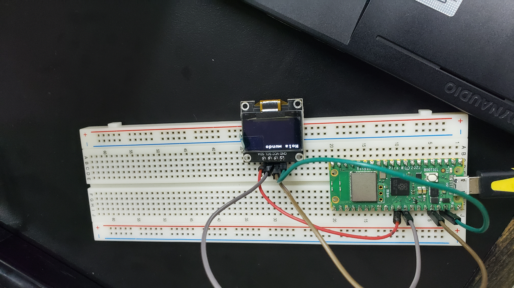
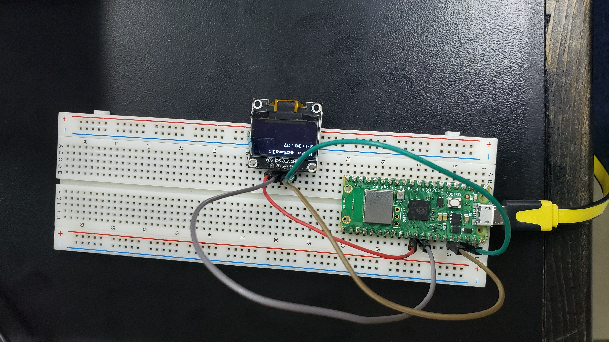

# Practica2.1
Foto de prueba practica hola mundo en pantalla oled

# CÓDIGO
```python
## Depto de Sistemas y Computación
## Ing. En Sistemas Computacionales
## SISTEMAS PROGRAMABLES 23a
## Autor (es): Emiliano García Cordero
## Repositorio: https://github.com/Capi2023/Practica2.1
## Fecha de revisión:   11/10/2023
## Objetivo: 2.1.1 Practica De inicio es la básico de Desplegar algo en pantalla, algunos quieren el logo de ISC, esta bien, otro texto simple, se agradece,  en el OLED DIsplay
##   

```




Foto de prueba practica para hola mundo y hora en pantalla oled


